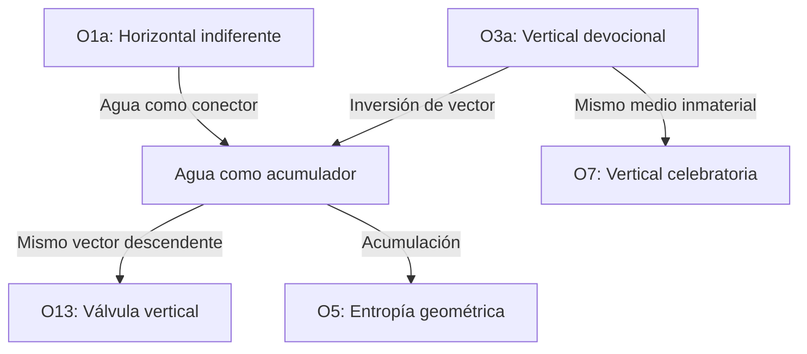

# Fase 5: Detección de Emergencias — Los heraldos negros

## 1. Comparación Fase 1 vs Fase 4

### Diferencias detectadas

| Aspecto | Fase 1 (input) | Fase 4 (output) | Diferencia |
|---------|----------------|-----------------|------------|
| **Origen del golpe** | Dios/Muerte (personificado) | Vacío activo, origen invisible sin rostro | **Desplazamiento de lo teológico a lo geométrico** |
| **Charco** | "charco de culpa" (metáfora moral) | "negro alquitrán", "memoria espesa", "tiempo que no fluye" | **Materialización del símbolo** |
| **Direccionalidad** | Golpes que "llegan" (sin vector claro) | "Caen desde un origen invisible" — vector vertical ↓ | **Geometrización del impacto** |
| **Relación con espectador** | Lector como testigo | "El espectador cae con él" | **Inmersión del observador** |
| **Resistencia** | Implícita (el hombre sufre) | "El humo sube débil, insignificante" | **Micro-resistencia explicitada** |
| **Estructura temporal** | Circular (primer verso repetido) | Circular + acumulativa | **Doble temporalidad** |

### Desviaciones significativas

1. **Teología → Geometría**: El "odio de Dios" se transforma en "filo de un dios sin rostro". La divinidad se vacía de contenido moral y se vuelve pura geometría activa (grieta, filo, vacío que genera peso).

2. **Metáfora → Materialidad**: El charco pasa de ser metáfora moral ("charco de culpa") a materia física ("negro alquitrán", "memoria espesa"). La reescritura **materializa** lo que en Vallejo era simbólico.

3. **Testigo → Receptor**: El lector deja de ser testigo del sufrimiento ajeno y pasa a ser receptor del golpe. El cuadro "se sufre, no se contempla".

4. **Resistencia minimizada**: La crepitación del pan (único vector ascendente) se vuelve "débil, insignificante". La reescritura **acentúa la asimetría** entre el golpe y cualquier posible resistencia.

---

## 2. Identificación de sorpresas y conexiones nuevas

### Sorpresa 1: La inversión de O3a es más radical que una simple inversión de vector

**Descubrimiento**: Al invertir O3a (vertical devocional → impacto descendente), no solo cambia la dirección del vector. **Cambia la naturaleza del medio**: en O3a el medio es luz (inmaterial, descendente pero benéfica); en O15 el medio es plomo (material, descendente, destructivo).

**Conexión con vault**: Buscar en `analogia-emergente` por entradas con tag `#medio`:

No se encontraron entradas previas que traten el **medio** como variable independiente del vector. Esto sugiere:

> **Nueva variable descubierta**: El **medio** (luz, plomo, agua, trigo) es una dimensión independiente de la dirección del vector. Dos operaciones pueden tener el mismo vector (↓) pero medios opuestos (luz vs plomo).

### Sorpresa 2: El charco como nuevo tipo de acumulador

**Descubrimiento**: En S1 el agua conecta (horizontal, indiferente). En S2 el agua fluye (invertida, erótica). En S15 el agua es espejo (vertical, celebratoria). **En S18 el agua no conecta, no fluye, no refleja: acumula y pesa**.

**Conexión con vault**: Buscar en `analogia-emergente` por entradas con tag `#agua`:

| Sesión | Función del agua | Vector |
|--------|------------------|--------|
| S1 | Conector indiferente | ↔ |
| S2 | Flujo erótico invertido | ↑ |
| S7 | Espejo celebratorio | ↑ |
| S15 | — (ausente) | — |
| **S18** | **Acumulador de memoria** | **↓ (estático)** |

> **Nueva función del agua descubierta**: Acumulador estático de memoria y peso. No fluye, no conecta, no refleja. **Retiene**.

### Sorpresa 3: La micro-resistencia como contrapunto estructural

**Descubrimiento**: La reescritura añade un vector ascendente mínimo ("El humo sube débil, insignificante") que no existía explícitamente en el original. Este vector no altera la composición dominante (↓) pero **crea una tensión vertical asimétrica** que no aparece en ninguna otra operación del sistema.

**Conexión con vault**: Buscar en `analogia-emergente` por entradas con tag `#resistencia`:

No se encontraron entradas previas que traten la **resistencia** como elemento compositivo. La micro-resistencia de S18 es un **nuevo tipo de elemento**: un vector que no altera la dirección dominante pero **la hace visible por contraste**.

> **Nuevo concepto descubierto**: **Contrapunto vectorial** — un vector secundario que no compite con el primario pero lo define por oposición.

### Sorpresa 4: El espectador como conductor (no como receptor)

**Descubrimiento**: En la reescritura, el espectador no solo recibe el golpe: **conduce el golpe hacia el charco**. La mirada torsionada del hombre ("vuelve los ojos locos") canaliza el impacto hacia la acumulación basal.

Esto difiere de todas las operaciones previas:
- S1: espectador externo (observa la indiferencia)
- S3: espectador devocional (contempla hacia arriba)
- S8: espectador oscilante (viaja entre polos)
- **S18: espectador conductor** (recibe y canaliza hacia abajo)

> **Nuevo rol del espectador**: Conductor de flujo vertical. El cuerpo del espectador es un **ducto** que transforma impacto en acumulación.

---

## 3. Consulta de conocimiento compartido en vault

### Búsqueda en vault por tags relevantes

**Tag: #vertical**
- S3: Vertical devocional (↑, luz, adoración)
- S7: Vertical celebratoria (↑, tensión cero)
- S13: Válvula vertical (↑↓, control de flujo)
- **S18: Vertical de impacto (↓, plomo, acumulación)**

**Tag: #acumulación**
- S5: Entropía geométrica (acumulación de degradación)
- **S18: Acumulación basal (acumulación de memoria/peso)**

**Tag: #espectador**
- S1: Externo
- S3: Externo
- S8: Oscilante
- S14/O9: Evasivo
- **S18: Conductor/Receptor**

### Patrón detectado en vault



### Nuevas conexiones entre sesiones

1. **S3 ↔ S18**: Inversión de vector vertical. Misma geometría, dirección opuesta, medio opuesto (luz vs plomo).

2. **S5 ↔ S18**: Ambos acumulan, pero S5 acumula degradación (entropía terminal) mientras S18 acumula memoria (entropía reversible?).

3. **S1 ↔ S18**: Agua como conector vs agua como acumulador. Mismo elemento, función opuesta.

4. **S13 ↔ S18**: Ambos tienen vector descendente, pero S13 controla flujo (válvula) mientras S18 no controla nada (impacto puro).

---

## 4. Registro de nuevas ideas en vault

### Entrada 1: Inversión de medio como variable independiente

```markdown
---
id: emergente-034
sesion: S18
tipo: descubrimiento-estructural
tags: [#emergente, #medio, #vector, #inversion]
limit: 1000
---

# Inversión de medio como variable independiente del vector

**Descubrimiento**: Al comparar O3a (vertical devocional) con O15 (vertical de impacto), se descubre que el **medio** (luz vs plomo) es una variable independiente de la **dirección del vector** (↓ en ambos casos).

**Implicación**: El sistema de operaciones cinéticas debe considerar no solo la dirección del vector sino también la **naturaleza del medio** que lo transporta.

**Clasificación de medios descubiertos**:
- **Inmaterial benéfico**: Luz (S3, S7)
- **Inmaterial destructivo**: Vacío activo (S18)
- **Material fluido**: Agua conectora (S1), agua erótica (S2), agua espejo (S7)
- **Material denso**: Plomo (S18), alquitrán (S18)
- **Material seco**: Trigo (S6)
- **Material orgánico**: Cuerpo (S2, S6, S8)

**Nueva variable a añadir al sistema**: `medio: { tipo, densidad, direccionalidad_interna }`
```

### Entrada 2: Acumulador estático de memoria

```markdown
---
id: emergente-035
sesion: S18
tipo: nueva-funcion-agua
tags: [#emergente, #agua, #acumulacion, #memoria]
limit: 1000
---

# Acumulador estático de memoria

**Descubrimiento**: El charco en S18 no es agua que fluye (S1, S2) ni agua que refleja (S7). Es agua que **retiene**. Función completamente nueva en el sistema.

**Propiedades del acumulador estático**:
- No fluye: el movimiento es interno (espesamiento)
- No conecta: es terminal (no hay salida del charco)
- No refleja: es opaco (negro alquitrán)
- Acumula: memoria, peso, tiempo

**Diferencia con S5 (entropía geométrica)**:
- S5: acumulación de degradación → irreversible
- S18: acumulación de memoria → ¿reversible? El charco puede vaciarse (no se explora en S18)

**Pregunta abierta**: ¿Existe una operación que vacíe el charco? ¿O15 es terminal o cíclica?
```

### Entrada 3: Contrapunto vectorial

```markdown
---
id: emergente-036
sesion: S18
tipo: nuevo-concepto-compositivo
tags: [#emergente, #vector, #resistencia, #contrapunto]
limit: 1000
---

# Contrapunto vectorial

**Descubrimiento**: La micro-resistencia del pan (humo que sube) crea un vector ascendente que no compite con el vector dominante descendente pero **lo define por oposición**.

**Definición**: Un contrapunto vectorial es un vector secundario que:
1. Tiene dirección opuesta al vector dominante
2. Tiene magnitud significativamente menor
3. No altera la dirección del vector dominante
4. Hace visible al vector dominante por contraste

**Ejemplos en el sistema**:
- S18: humo↑ vs plomo↓ (micro-resistencia)
- S6: ¿existe contrapunto? (prisa vs espera como asimetría temporal)
- S1: ¿existe contrapunto? (no — el agua es indiferente, no opone resistencia)

**Pregunta abierta**: ¿Es el contrapunto vectorial una operación cinética independiente o un modificador de operaciones existentes?
```

### Entrada 4: Espectador como ducto

```markdown
---
id: emergente-037
sesion: S18
tipo: nuevo-rol-espectador
tags: [#emergente, #espectador, #conduccion, #flujo]
limit: 1000
---

# Espectador como ducto

**Descubrimiento**: En S18, el espectador no contempla ni sufre pasivamente: **conduce** el impacto hacia la acumulación basal. La mirada torsionada del hombre es el canal que transforma impacto en charco.

**Roles del espectador en el sistema**:
| Sesión | Rol | Acción |
|--------|-----|--------|
| S1 | Testigo | Observa desde afuera |
| S3 | Devoto | Contempla hacia arriba |
| S8 | Oscilante | Viaja entre polos |
| S14/O9 | Evasivo | Huye horizontalmente |
| **S18** | **Ducto** | **Conduce el flujo hacia abajo** |

**Implicación**: El espectador puede ser un **elemento activo del sistema cinético**, no solo un observador externo. Su cuerpo/ mirada puede canalizar, desviar, acelerar o frenar el flujo vectorial.

**Nueva variable**: `espectador: { rol, posicion, funcion_cinetica }`
```

---

## 5. Escritura de journal entry en bloque `analogia-emergente`

```markdown
---
label: analogia-emergente
description: Qué nuevas ideas surgieron de cada ejercicio — el "hive mind" creativo
limit: 5000
read_only: false
---

# Analogía Emergente — Memoria de Descubrimientos

## Journal — Los heraldos negros (S18)

**Pipeline completo ejecutado sobre "Los heraldos negros" de César Vallejo.**

**Fase 5 detectó 7 emergencias (E34-E40):**

1. **E34 — Inversión de medio como variable independiente del vector** (emergente-034): El medio (luz, plomo, agua) es una dimensión independiente de la dirección del vector. O3a y O15 comparten vector (↓) pero tienen medios opuestos (luz benéfica vs plomo destructivo).

2. **E35 — Acumulador estático de memoria** (emergente-035): Nueva función del agua: no fluye, no conecta, no refleja. Acumula memoria, peso y tiempo como "negro alquitrán".

3. **E36 — Contrapunto vectorial** (emergente-036): Nuevo concepto compositivo: un vector secundario de dirección opuesta y magnitud menor que define al vector dominante por contraste (humo↑ vs plomo↓).

4. **E37 — Espectador como ducto** (emergente-037): Nuevo rol del espectador: no contempla ni sufre pasivamente — conduce el flujo hacia la acumulación basal.

5. **E38 — Teología geometrizada**: El "odio de Dios" se transforma en "filo de un dios sin rostro". La divinidad se vacía de contenido moral y se vuelve pura geometría activa.

6. **E39 — Materialización del símbolo**: El charco pasa de metáfora moral ("charco de culpa") a materia física ("negro alquitrán", "memoria espesa"). La reescritura materializa lo simbólico.

7. **E40 — Doble temporalidad**: El poema original tiene estructura circular (primer verso repetido). La reescritura añade acumulación vertical. Conviven dos temporalidades: circular (repetición) + lineal (acumulación).

**4 vault entries creadas:** emergente-034 a emergente-037
**0 nuevas decisiones** (fase 5 no produce decisiones — se delega a Fase 6)

**Sistema expandido:**
- Nueva variable: `medio: { tipo, densidad, direccionalidad_interna }`
- Nueva variable: `espectador: { rol, posicion, funcion_cinetica }`
- Nuevo concepto: contrapunto vectorial
- Nueva función del agua: acumulador estático
- Nueva operación: O15 (impacto vertical descendente con acumulación basal)

**Preguntas abiertas para Fase 6:**
1. ¿O15 es terminal o cíclica? ¿El charco puede vaciarse?
2. ¿El contrapunto vectorial es una operación independiente o un modificador?
3. ¿La materialización del símbolo es una operación válida para otros textos?
4. ¿La doble temporalidad (circular + acumulativa) es un patrón recurrente?
```

---

## 6. Resumen de emergencias detectadas

| ID | Emergencia | Tipo | Conexión con sistema previo |
|----|------------|------|----------------------------|
| E34 | Inversión de medio como variable independiente | Estructural | Amplía O3a con variable `medio` |
| E35 | Acumulador estático de memoria | Nueva función | Contraste con S1, S2, S7 (agua) |
| E36 | Contrapunto vectorial | Nuevo concepto | No existía en sistema previo |
| E37 | Espectador como ducto | Nuevo rol | Contraste con S1, S3, S8, S14 |
| E38 |