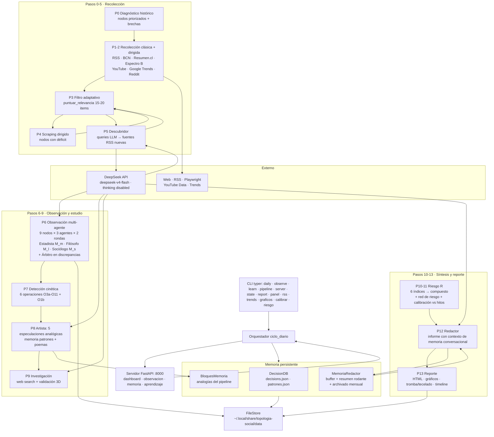

# Diagrama del Proyecto — Topología Social

Sistema multi-agente para observación topológica de la cultura (Chile).
Vista de flujo del ciclo diario y de la arquitectura de capas.

## Vista Mermaid (renderizable en GitHub / VSCode)



## Vista ASCII (terminal)

```
                        EXTERNO ────────────────────────────────
        DeepSeek API (LLM) · Web HTTP/RSS · Playwright · YouTube Data · Trends
                              ▲      ▲        ▲         ▲           ▲
══════════════════════════════╪══════╪════════╪═════════╪═══════════╪══════
PASO 0         PASO 1-2        │      │        │         │           │
[Diagnóstico] →[Recolección]───┼──────┼────────┼─────────┼───────────┘
  estrategia    web/rss · bcn · resumen · espectro_b · youtube · tendencias
  (nodos prior, │  + dirigida (queries por nodo)
   brechas)     │
                ▼
PASO 3-5      [Filtro adaptativo] ──► [Scraping déficit] ──► [Descubridor]
               puntuar_relevancia     web/scraping            web/descubridor
               web/relevancia                               (queries LLM → RSS nuevos)
                │                           │                    │
                ▼                           ▼                    ▼
PASO 6        [Observación multi-agente] ─── 54 llamadas LLM ───► LLMClient
               9 nodos × 3 agentes × 2 rondas                    (thinking disabled)
               Estadista(M_m) Filósofo(M_l) Sociólogo(M_s) ──► Árbitro (discrepancias)
                │
                ▼
PASO 7        [Detección cinética]      math/operations  (O3a, O4a, O5, O6, O9, O11, O1b)
                │
                ▼
PASO 8-9      [Artista] ── patrones analógicos (memoria/patrones.json + poemas)
               │              5 especulaciones + preguntas abiertas
               ▼                    │
              [Investigación] ◄────┘  web/search · validación 3D (Estadista/Filósofo/Sociólogo)
               │
               ▼
PASO 10-11    [Riesgo R] ──────────────────────────────── math/torus (δ, θ, M, formas)
               6 índices (escalar/indices) · compuesto ──► escalar/red_riesgo → redes_riesgo/
               + Calibración vs 7 hitos (config/hitos.yaml)
               │
               ▼
PASO 12-13    [Redactor] ──► memoria conversacional (buffer + resumen + archivado)
               │                informe_Chile_*.html ──► Desktop/informe_topologia.html
               │                + graficos (scripts/analisis_graficos)
               │                + tromba/tecelado (scripts/visualizar_tromba_tecelado)
               ▼                + timeline (scripts/barrido_timeline + graficos_timeline)
            [Memoria] ──► DecisionDB(decisions/patrones.json) · BloquesMemoria(analogías)
══════════════════════════════════════════════════════════════════════════
                    STORAGE  FileStore → ~/.local/share/topologia-social/data/
                    estados/ · reportes/ · reportes_json/ · memoria/ · proyecciones/
══════════════════════════════════════════════════════════════════════════
CLI (main.py)                 SERVIDOR (fastapi, port 8000)
 daily · observe · learn      routers: dashboard · observacion
 pipeline · server · state    memoria · aprendizaje
 report · panel · rss
 trends · graficos · calibrar
 riesgo · test-llm
══════════════════════════════════════════════════════════════════════════
PIPELINE ANALÓGICO (pipeline/engine + skills/fase1..6): inmersion → pictorica → analisis
→ reescritura → emergencias → formalizacion   (usa BloquesMemoria: analogia-visual/cinetica/emergente)
```

## Componentes clave

| Módulo | Responsabilidad |
|---|---|
| `models/llm.py` | `LLMClient`: llamadas DeepSeek con `thinking disabled` + retries + fallback |
| `agents/` | Estadista (M_m), Filósofo (M_l), Sociólogo (M_s), Árbitro, Artista, Redactor |
| `math/` | torus (tromba ℝ×T³, formas complejas, δ/θ), operations (cinética), unity/coherence (ente fractal) |
| `escalar/` | 6 índices de riesgo → compuesto R → red de riesgo |
| `memoria/` | DecisionDB (decisiones/patrones), BloquesMemoria (analogías), MemoriaRedactor (conversacional) |
| `storage/store.py` | FileStore → `estados/`, `reportes/`, `reportes_json/`, `memoria/`, `proyecciones/` |
| `web/` | rss, bcn, resumen, espectro_b, youtube, tendencias, scraping, search, descubridor, historico, gutenberg, reddit |
| `orchestrator.py` | Ciclo diario (pasos 0-13), orquesta agentes, memoria y reportes |
| `pipeline/engine.py` | Pipeline analógico fase1-6 (skills/) |
| `server/` | FastAPI: dashboard, observacion, memoria, aprendizaje |
